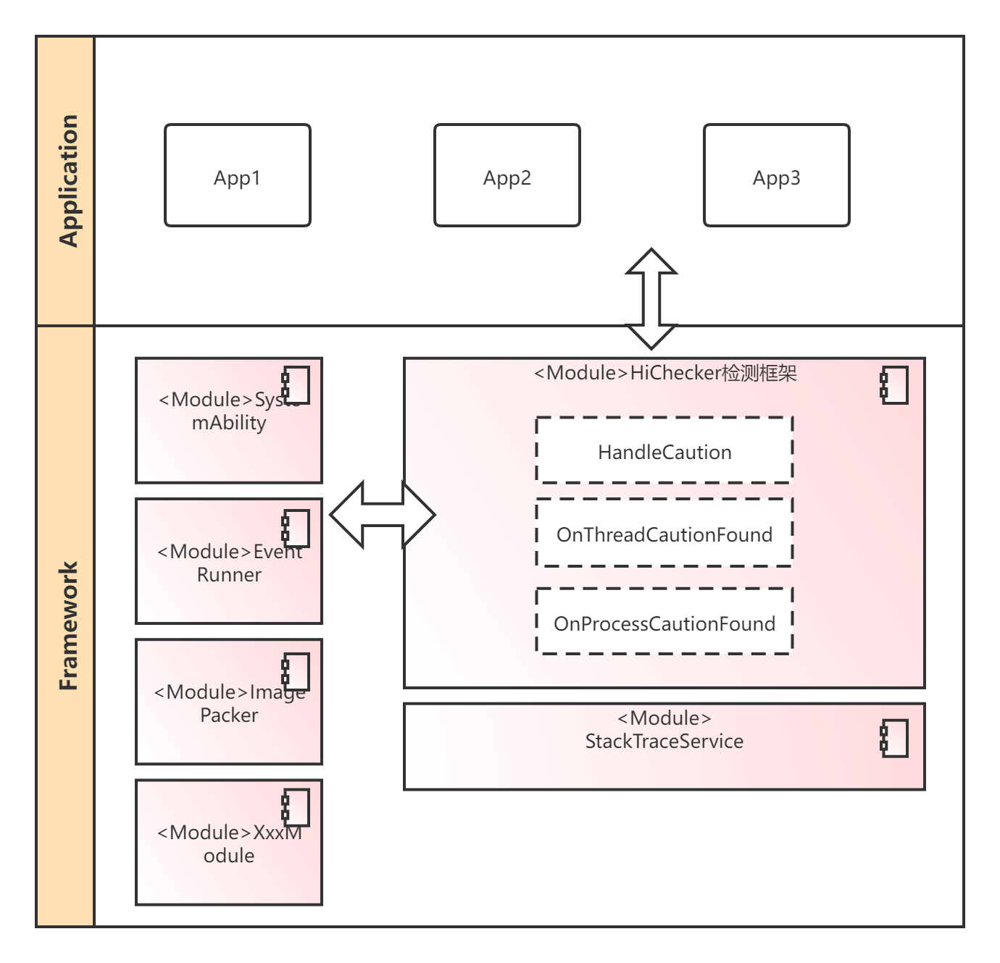

# HiChecker组件

-   [简介](#section11660541593)
-   [架构](#section161941989596)
-   [目录](#section14197309111)
-   [说明](#section1371113476307)
-   [涉及仓](#section1371113476310)

## 简介<a name="section11660541593"></a>

​        本模块主要作用是给基于OpenHarmony的应用（包含系统和三方应用）开发者提供一套检测工具，用来检测应用程序开发过程中容易引人忽略的部分问题，包括应用线程出现耗时调用、应用进程中元能力资源泄露等问题，检测到的问题以日志记录或进程crash等形式展现出来以便开发者发现并修改相关问题，提升应用使用体验

## 架构<a name="section161941989596"></a>

 

| 依赖部件                                                    | 依赖描述                                                     |
| ----------------------------------------------------------- | ------------------------------------------------------------ |
| 媒体子系统/【image部件】图片基础框架 ImagePacker            | 在比较耗时的函数中调用HiChecker接口，通知有耗时调用，同时传入对应的告警提示字符串 |
| 事件通知子系统/common_event部件 EventRunner                 | 提供时间分发阈值设置接口，提供超时检测功能                   |
| 元能力子系统/ability_runtime/运行管理支持DFX FeatureAbility | 提供注册泄露检测逻辑，通知检测模式相关结果                   |

支持特性：

- 提供耗时调用检测功能
- 提供注册（ability） 泄露检测功能
- 提供耗时消息检测功能
- 支持应用增加、删除不同的检测规则
- 支持应用增加、删除不同的告警通知规则，目前支持记录流水日志（默认），应用崩溃两种规则
- 对外接口支持C++/JS形态两种接口
- 相关检测条件满足时，支持Native回栈到关键触发点，暂不支持JS回栈

## 目录<a name="section14197309111"></a>

```
/base/hiviewdfx/hichecker
├── frameworks          # 框架代码
│   └── native          # HiChecker native实现代码
├── interfaces          # 接口
│   └── native          # C++接口
│       └── innerkits   # 对内部子系统暴露的头文件
|   └── js              # JS接口
│       └── kits        # 对应用暴露的头文件
├── test                # 测试用例
│   └── unittest            
```


## 说明<a name="section1371113476307"></a>
### 接口说明

主要接口说明

| 类        | 方法                                                | 描述                             |
| --------- | :-------------------------------------------------- | -------------------------------- |
| HiChecker | BigInt RULE_CAUTION_PRINT_LOG = 1<<63;              | 告警规则，仅记录日志             |
|           | BigInt RULE_CAUTION_TRIGGER_CRASH = 1<<62;          | 告警规则，让应用退出             |
|           | BigInt RULE_THREAD_CHECK_SLOW_PROCESS = 1;          | 检测规则，检测耗时函数调用       |
|           | BigInt RULE_CHECK_SLOW_EVENT = 1<<32;               | 检测规则，检测耗时事件分发与处理 |
|           | BigInt RULE_CHECK_ABILITY_CONNECTION_LEAK = 1<<33;  | 检测规则，检测ability泄露        |
|           | addRule(BigInt rule) : void                         | 增加一个或多个检测项             |
|           | removeRule(BigInt rule) : void                      | 删除一个或多个检测项             |
|           | getRule() : BigInt                                  | 获取所有检测项                   |
|           | contains(BigInt rule) : boolean                     | 当前是否有某一个检测项           |
|           | NotifySlowProcess(std::string) : void               | 通知有耗时调用                   |
|           | NotifySlowEvent(std::string) : void                 | 通知有耗时事件                   |
|           | NotifyAbilityConnectionLeak(Caution caution) : void | 通知有ability泄露                |
| Caution   | GetTriggerRule() : BigInt                           | 获取触发当前告警的检测规则       |
|           | GetCustomMessage() : String                         | 获取更多辅助信息                 |
|           | GetStackTrace() ：String                            | 获取堆栈信息                     |

### 使用说明

1. 添加单条规则

   ```js
   hichecker.addRule(hichecker.RULE_CAUTION_PRINT_LOG );
   ```

2. 添加多条规则

   ```
   hichecker.addRule(hichecker.RULE_CAUTION_PRINT_LOG | hichecker.RULE_CHECK_SLOW_EVENT);
   ```

## 涉及仓<a name="section1371113476310"></a>

[DFX子系统](https://gitee.com/openharmony/docs/blob/master/zh-cn/readme/DFX子系统.md)

[hiviewdfx_hilog](https://gitee.com/openharmony/hiviewdfx_hilog/blob/master/README_zh.md)

[hiviewdfx_faultloggerd](https://gitee.com/openharmony/hiviewdfx_faultloggerd/blob/master/README_zh.md)
